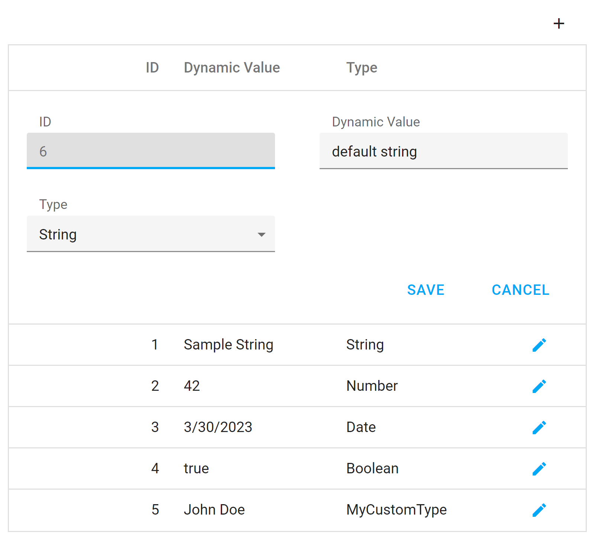

<!-- default badges list -->

<!-- default badges end -->

# DataGrid for DevExtreme - How to handle different value types with editCellTemplate for the same column

This example describes a typical usage scenario where users want to have a dynamic column. For instance a column must handle strings/numbers/dates etc.

DataGrid's column data type is specified in the dataType property. If this property is not set it is auto-predicted based on the first row. So, this causes an issue for most customers where their input data changes to a different data type (e.g., input is a string, but it gets cast to a date/number).

## Files to Review

- **jQuery**
  - [index.js](jQuery/src/index.js)
- **Angular**
  - [app.component.html](Angular/src/app/app.component.html)
  - [app.component.ts](Angular/src/app/app.component.ts)
  - [dynamic-edit-component.component.html](Angular/src/app/dynamic-edit-component/dynamic-edit-component.component.html)
  - [dynamic-edit-component.component.ts](Angular/src/app/dynamic-edit-component/dynamic-edit-component.component.ts)
- **Vue**
  - [DynamicDataGrid.vue](Vue/src/components/DynamicDataGrid/DynamicDataGrid.vue)
  - [DynamicEditComponent.vue](Vue/src/components/DynamicDataGrid/templates/DynamicEditComponent.vue)
- **React**
  - [App.tsx](React/src/App.tsx)
  - [DynamicEditCellComponent.tsx](React/src/components/DynamicEditCellComponent.tsx)
  - [CellComponent.tsx](React/src/components/CellComponent.tsx)

## Implementation Details

Set your dynamic column's dataType property to "object". Then, store the data type in a data field, specify editCellTemplate and check the data.Type field's value to render the related editor. Finally, use the setCellValue callback of the Type column to update your dynamic column and rerender editCellTemplate.

## Documentation

- [DataGrid.columns.editCellTemplate](https://js.devexpress.com/Documentation/ApiReference/UI_Components/dxDataGrid/Configuration/columns/#editCellTemplate)
- [DataGrid.columns.cellTemplate](https://js.devexpress.com/Documentation/ApiReference/UI_Components/dxDataGrid/Configuration/columns/#cellTemplate)
- [DataGrid.columns.setCellValue](https://js.devexpress.com/Documentation/ApiReference/UI_Components/dxDataGrid/Configuration/columns/#setCellValue)
